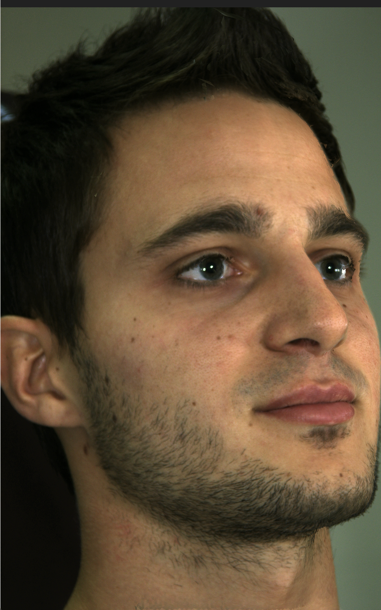
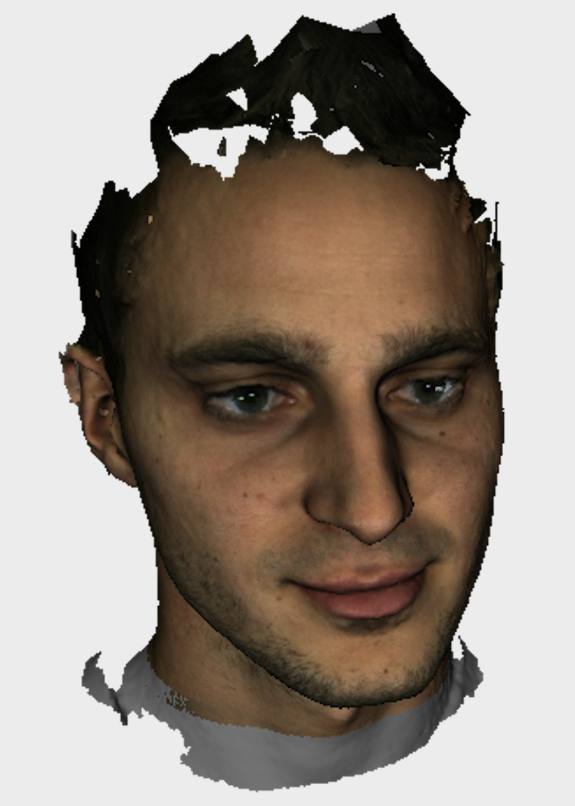
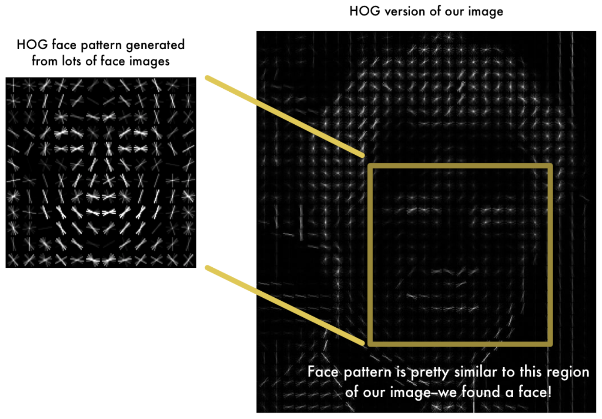
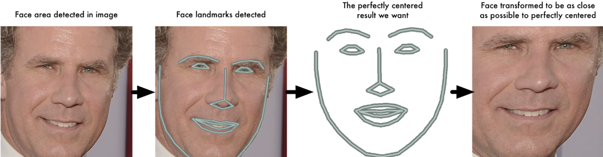
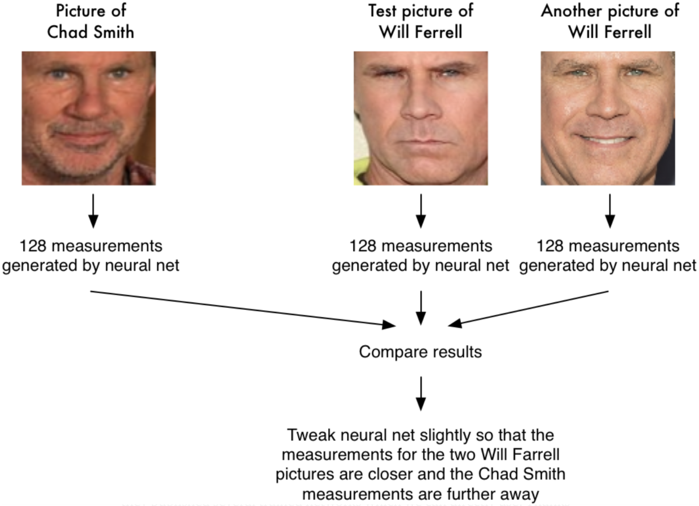
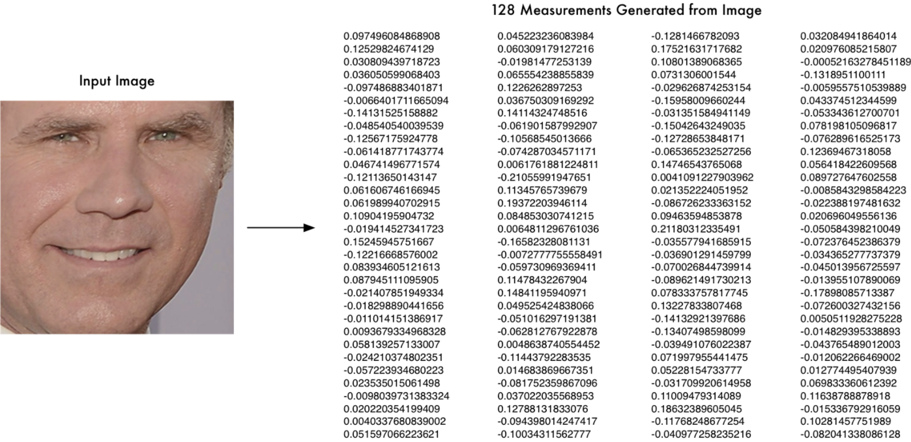
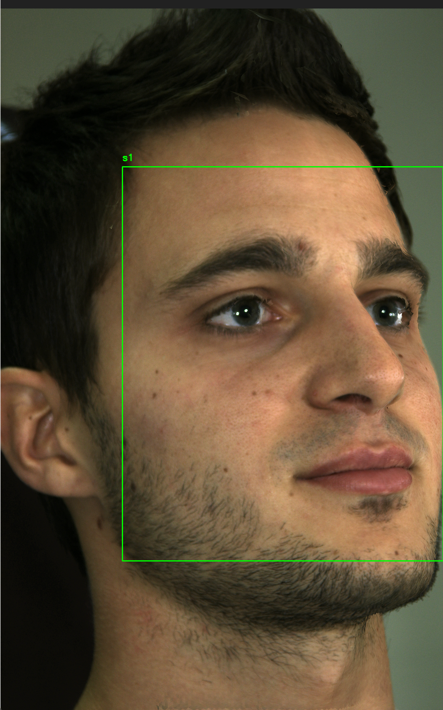

# 3D-Model-Facial-Recognition

This is the final project for the CS-GY-6643 Computer Vision course at NYU Tandon School of Engineering.

## Introduction

**In this project, we explore the use of synthetic 2D images from 3D models for use in a 2D facial recognition system.** This may prove to be useful in situations where identification of an individual is warranted, but only a scant number of images of that person's face are available. Using those images, it is often possible to create a 3D facial reconstruction from which a substantial amount of 2D images can be generated for training. Additionally, whereas non-synthetic images of a person's face may exhibit varying lighting, facial expressions, and head poses, synthetic images can preserve greater consistency in terms of these conditions. Thus, the generation of a large, homogenous collection of synthetic face images for training can significantly improve the reliability of a given facial recognition model.

We generated synthetic images based on the 3D models provided in the [Florence 3D Faces dataset](https://www.micc.unifi.it/resources/datasets/florence-3d-faces), and then implemented facial recognition through deep metric learning using Histogram of Oriented Gradients (HOG) and k-Nearest Neighbors (k-NN). Facial recognition implementation was based off of [this tutorial](https://www.pyimagesearch.com/2018/06/18/face-recognition-with-opencv-python-and-deep-learning/), and **makes use of [OpenCV](https://opencv.org), [dlib](http://dlib.net) and the [face_recognition module](https://github.com/ageitgey/face_recognition)**.

## The Dataset

Downloading the Florence 3D Faces dataset requires submission of a license agreement (information can be found [here](http://www.micc.unifi.it/vim/3dfaces-dataset/index.html#!prettyPhoto)). Once downloaded, the dataset should exist in a directory called ```Florence Face``` and contain subdirectories for each individual with the following structure: 

```bash
├── subject_01
│   └── Model
│       ├── frontal1
│       │   ├── obj
│       │   └── vrml
│       ├── frontal2
│       │   ├── obj
│       │   └── vrml
│       ├── sidel
│       │   ├── obj
│       │   └── vrml
│       └── sider
│           ├── obj
│           └── vrml
```
The 3D models for this project are the ```.obj``` files in ```../frontal1/obj``` and ```../frontal2/obj```. The following is an example of one such model opened in Xcode 11.6: 


Additionally, the images used for testing our model are the ```.bmp``` files in each ```../frontal1/obj``` (only one side of a subject's face is used):




## Synthetic Code Generation

The code for synthetic image generation can be found in [Synthetic Image Genration.ipynb](https://github.com/jmg764/3D-Model-Facial-Recognition/blob/master/Synthetic%20Image%20Generation.ipynb). It requires installation of the packages ```pywavefront``` and ```pyglet```. 

The number of snapshots taken per 3D model is set to 50 by default, but can be changed by altering the value of ```MAX_SNAPSHOTS``` in Synthetic Image Genration.ipynb.

Each time a snapshot of a subject is taken, it undergoes a random transformation dictated by the following, thereby creating a variety of angles and positions for our training data:

```python 
if snapshotsTaken < MAX_SNAPSHOTS and transformations is None:
        xOffset = random.uniform(-100.0, 100.0)
        yOffset = random.uniform(-100.0, 100.0)
        zOffset = random.uniform(-500.0, -300.0)
        xRotate = random.uniform(-50.0, 50.0)
        yRotate = random.uniform(-5.0, 5.0)
        transformations = (xOffset, yOffset, zOffset, xRotate, yRotate)
```

Synthetic images are saved in a file called ```synthetic_training_data``` which is organized into subdirectories corresponding to each subject. Here is an example of one of the snapshots created:



## Deep Metric Learning

Face recognition through deep metric learning involves the use of a neural network to output a real-valued feature vector, or embedding, which is used to quantify a given face. The network used in this project is based on the ResNet-34 architecture described [here](https://arxiv.org/abs/1512.03385), but with a few layers removed and the number of filters per layer reduced by half. It was already trained on a dataset of approximately 3 million images, and obtained a 99.38% accuracy on the [Labeled Faces in the Wild](http://vis-www.cs.umass.edu/lfw/) benchmark. This means that, given two images, it correctly predicts if the images are of the same person 99.38% of the time. In this project, the network is further trained on the Florence 3D Faces dataset.

**Creation of the embeddings used for training involves facial detection, affine transformation, encoding faces, and labeling the test image, as detailed below:**

### 1. Facial Detection with HOG

Before we can go about recognizing faces, we must first locate them in our images. In general, any sort of object detection requires comparison between a known image and the image in question to see if a pattern or feature match exists. It is tempting to compare pixels directly, but very dark and very light images of the same object will have completely different pixel values. Histogram of Oriented Gradients (HOG) is an object detection method that solves this problem by only considering the direction that brightness changes (gradient orientation) in a particular region of an image. This captures the major features of an image regardless of image brightness. Comparison of a given image with a HOG face pattern generated from many images can aid in facial detection as shown in the following image obtained from [this article](https://medium.com/@ageitgey/machine-learning-is-fun-part-4-modern-face-recognition-with-deep-learning-c3cffc121d78):



### 2. Affine Transformation

Now that faces are isolated in our images, each image needs to be warped so that facial features are in the same location for each image. This makes it easier for our neural network to compare faces later on. Once facial features are identified through [facial landmark estimation](http://www.csc.kth.se/~vahidk/papers/KazemiCVPR14.pdf), an affine transformation is used to accomplish this warping:



### 3. Encoding Faces

The simplest approach to facial recognition would be to compare an unknown face with every image that is already labeled. If there is a large number of images, however, this can take an unnecessarily long time. A faster way would be to use a few basic measurements from each face as a basis for comparison. Given an unknown face, the goal would be to find the labeled face with the closest measurements.

But which measurements should we consider? It turns out that the measurements that seem obvious to us, such as eye color, nose length, and ear size, aren't necessarily valuable measurements to a computer looking at individual pixels of an image. The most accurate approach is to use deep learning to identify the parts of a face that are important to measure. This is the idea behind "training" a neural network for facial recognition. Here, we will be generating 128 measurements for each face in the form of a vector (in other words, a *128-d embedding*).

Training involves a "triplet training step" in which the network creates embeddings for three unique face images –– two of which are the same person. The network is tweaked slightly so that the measurements it generates for the two images of the same person are closer via distance metric than those for the image of the other person:



Once the network has been trained, it can generate measurements for faces it hasn't seen before. Here is an example of measurements generated from a test image:



(Example images are from [this article](https://medium.com/@ageitgey/machine-learning-is-fun-part-4-modern-face-recognition-with-deep-learning-c3cffc121d78)).

The parts of the face that these 128 numbers are measuring doesn't matter to us. What does matter, however, is that the network generates nearly the same numbers when looking at two different images of the same person. 

### 4. Labeling the Test Image

The final step is to compare the embedding of a test image with those in a database of labeled faces. This can be accomplished through a basic machine learning algorithm such as SVM or k-Nearest Neightbors. The label with the closest match to the test image is the new label assigned to the test image.


## Implementation

### 1. Encode Faces

In ```encode_faces.py```, we make use of the ```face_recognition``` module which is built on top of ```dlib```. The arguments that can be passed into this script are dictated by:

```python

ap = argparse.ArgumentParser()
ap.add_argument("-i", "--dataset", required=True,
	help="path to input directory of faces + images")
ap.add_argument("-e", "--encodings", required=True,
	help="path to serialized db of facial encodings")
ap.add_argument("-d", "--detection-method", type=str, default="cnn",
	help="face detection model to use: either `hog` or `cnn`")
args = vars(ap.parse_args())

```

```--dataset``` provides the path to the dataset of training images, ```--encodings``` points to the file where face encodings will be stored (in this case that file is called ```embeddings.pickle```, and ```--detection-method``` specifies the face detection model that will be used (either HOG or CNN).

Images are converted to RGB since ```dlib``` expects that image format as input:

```python
image = cv2.imread(imagePath)
rgb = cv2.cvtColor(image, cv2.COLOR_BGR2RGB)
```

Next, for each image in the training set, face localization and computation of embeddings is accomplished through the following:

```python 
# detect the (x, y)-coordinates of the bounding boxes
# corresponding to each face in the input image
boxes = face_recognition.face_locations(rgb,
	model=args["detection_method"])

# compute the facial embedding for the face
encodings = face_recognition.face_encodings(rgb, boxes)

# loop over the encodings
for encoding in encodings:
	# add each encoding + name to our set of known names and encodings
	knownEncodings.append(encoding)
	knownNames.append(name)
```

The resulting encodings are then saved to disk for use in ```recognize_faces_image.py```, which handles facial recognition:

```python

# dump the facial encodings + names to disk
print("[INFO] serializing encodings...")
data = {"encodings": knownEncodings, "names": knownNames}
f = open(args["encodings"], "wb")
f.write(pickle.dumps(data))
f.close()

```

To create face embeddings for the synthetic images created earlier, we run ```encode_faces.py``` in the terminal:

```bash

$ python encode_faces.py --dataset synthetic_training_data --encodings encodings.pickle --detection-method hog
[INFO] quantifying faces...
[INFO] processing image 1/300
[INFO] processing image 2/300
[INFO] processing image 3/300
...
[INFO] processing image 298/300
[INFO] processing image 299/300
[INFO] processing image 300/300
[INFO] serializing encodings...

```

### 2. Facial Recognition

In ```recognize_faces_image.py```, ```face_recognition``` is used on a test image to localize and encode one or more faces in the image, and compare this new embedding with the embedding previously computed in ```encode_faces.py```. The following are the arguments that can be passed into this script:

```python

ap = argparse.ArgumentParser()
ap.add_argument("-e", "--encodings", required=True,
	help="path to serialized db of facial encodings")
ap.add_argument("-i", "--image", required=True,
	help="path to input image")
ap.add_argument("-d", "--detection-method", type=str, default="cnn",
	help="face detection model to use: either `hog` or `cnn`")
args = vars(ap.parse_args())

```

```--encodings``` provides the path to the encodings file created earlier, ```--image``` provides the test image, and ```--detection-method``` specifies the facial detection method used on the input image (in this case it is HOG once again).

Similar to before, here we input the test image and create embeddings for each face in that image:

```python

# load the input image and convert it from BGR to RGB
image = cv2.imread(args["image"])
rgb = cv2.cvtColor(image, cv2.COLOR_BGR2RGB)

# detect the (x, y)-coordinates of the bounding boxes corresponding to each face in the input image, then compute the facial embeddings for each face
print("[INFO] recognizing faces...")
boxes = face_recognition.face_locations(rgb,
	model=args["detection_method"])
encodings = face_recognition.face_encodings(rgb, boxes)

```

Next, we loop over all encodings in the test image and attempt to match each face in the image to those in the known encodings dataset:

```python

# loop over the facial embeddings
for encoding in encodings:
	# attempt to match each face in the input image to our known encodings
	matches = face_recognition.compare_faces(data["encodings"],
		encoding)
	name = "Unknown"

```

```compare_faces``` essentially performs **k-NN** for classification by computing the Euclidean distance between the candidate embedding and all faces in the dataset. If matches exist, ```compare_faces``` returns ```True``` for each labeled image associated with a match. Thus, in order to label the test image, we must count the number of "votes" per label, and select the label with the most votes:

```python

# check to see if we have found a match
if True in matches:
	# find the indexes of all matched faces then initialize a dictionary to count the total number of times each face was matched
	matchedIdxs = [i for (i, b) in enumerate(matches) if b]
	counts = {}

	# loop over the matched indexes and maintain a count for each recognized face face
	for i in matchedIdxs:
		name = data["names"][i]
		counts[name] = counts.get(name, 0) + 1

	# determine the recognized face with the largest number of votes (note: in the event of an unlikely tie Python will select first entry in the dictionary)
	name = max(counts, key=counts.get)
# update the list of names
names.append(name)

```

The following terminal command executes this scipt using the first test image (```test1```) in ```test_data```:

```bash 

$ python recognize_faces_image.py --encodings encodings.pickle --image test_data/test1.png --detection-method hog
[INFO] loading encodings...
[INFO] recognizing faces...

```

Which results in:



"s1" corresponds to the first person in the dataset as expected. Subjects 2-5 are correctly labeled as well, but no face is detected for subject 6
