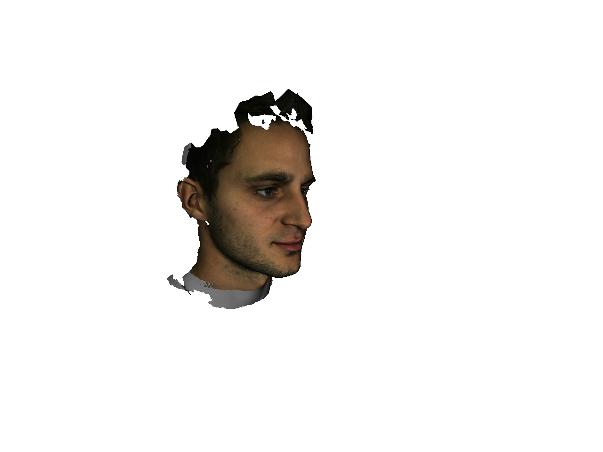

# 3D-Model-Facial-Recognition

This is the final project for the CS-GY-6643 Computer Vision course at NYU Tandon School of Engineering.

## Introduction

**In this project, we explore the use of synthetic 2D images from 3D models for use in a 2D facial recognition system.** This may prove to be useful in situations where identification of an individual is warranted, but only a scant number of images of that person's face are available. Using those images, it is often possible to create a 3D facial reconstruction from which a substantial amount of 2D images can be generated for training. Additionally, whereas non-synthetic images of a person's face may exhibit varying lighting, facial expressions, and head poses, synthetic images can preserve greater consistency in terms of these conditions. Thus, the generation of a large, homogenous collection of synthetic face images for training can significantly improve the reliability of a given facial recognition model.

We generated synthetic images based on the 3D models provided in the [Florence 3D Faces dataset](https://www.micc.unifi.it/resources/datasets/florence-3d-faces), and then implemented facial recognition using Histogram of Oriented Gradients (HOG) and k-Nearest Neighbors (k-NN) as described in [this tutorial](https://www.pyimagesearch.com/2018/06/18/face-recognition-with-opencv-python-and-deep-learning/).

## The Dataset

Downloading the Florence 3D Faces dataset requires submission of a license agreement (information can be found [here](http://www.micc.unifi.it/vim/3dfaces-dataset/index.html#!prettyPhoto)). Once downloaded, the dataset should exist in a directory called ```Florence Face``` and contain subdirectories for each individual with the following structure: 

```bash
├── subject_01
│   └── Model
│       ├── frontal1
│       │   ├── obj
│       │   └── vrml
│       ├── frontal2
│       │   ├── obj
│       │   └── vrml
│       ├── sidel
│       │   ├── obj
│       │   └── vrml
│       └── sider
│           ├── obj
│           └── vrml
```
The 3D models for this project are the ```.obj``` files in ```../frontal1/obj``` and ```../frontal2/obj```. The following is an example of one such model opened in Xcode 11.6: 


Additionally, the images used for testing our model are the ```.bmp``` files in each ```../frontal1/obj``` (only one side of a subject's face is used):


## Synthetic Code Generation

The code for synthetic image generation can be found in [Synthetic Image Genration.ipynb](https://github.com/jmg764/3D-Model-Facial-Recognition/blob/master/Synthetic%20Image%20Generation.ipynb). It requires installation of the packages ```pywavefront``` and ```pyglet```. 

The number of snapshots taken per 3D model is set to 50 by default, but can be changed by altering the value of ```MAX_SNAPSHOTS``` in Synthetic Image Genration.ipynb.

Each time a snapshot of a subject is taken, it undergoes a random transformation dictated by the following, thereby creating a variety of angles and positions for our training data:

```python 
if snapshotsTaken < MAX_SNAPSHOTS and transformations is None:
        xOffset = random.uniform(-100.0, 100.0)
        yOffset = random.uniform(-100.0, 100.0)
        zOffset = random.uniform(-500.0, -300.0)
        xRotate = random.uniform(-50.0, 50.0)
        yRotate = random.uniform(-5.0, 5.0)
        transformations = (xOffset, yOffset, zOffset, xRotate, yRotate)
```

Synthetic images are saved in a file called ```synthetic_training_data``` which is organized into subdirectories corresponding to each subject. Here is an example of one of the snapshots created:



## HoG

